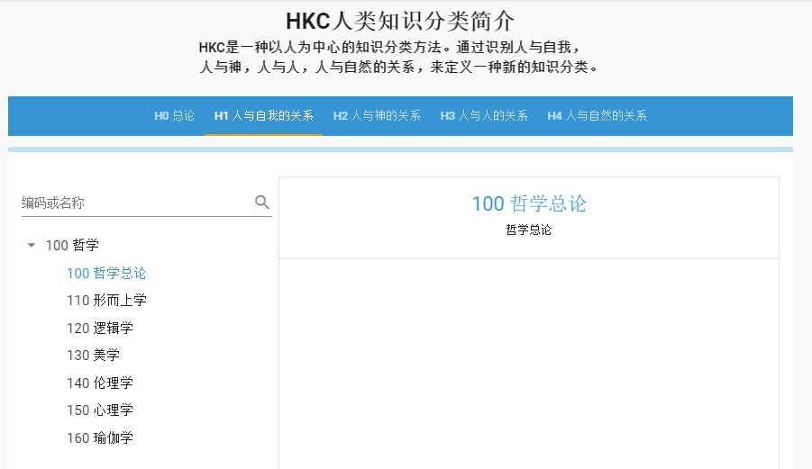
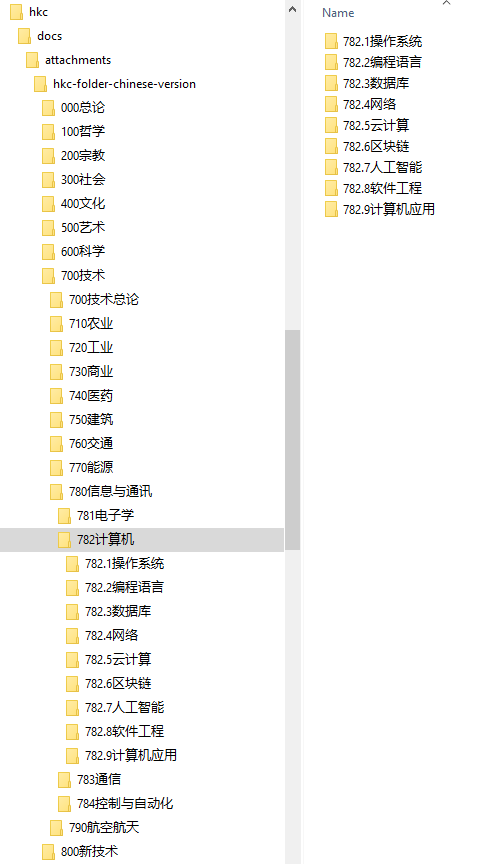
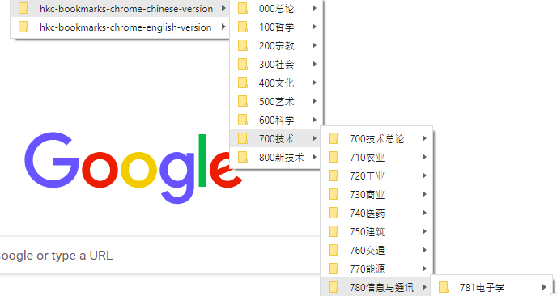
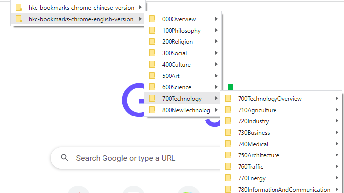

简体中文 | [English](./README.english.md)

# 目录
 * [一、HKC是什么](#1)
 * [二、HKC介绍](#2)
 * [三、附件](#3)
 * [四、联系方式](#4)

 ## <h2 id="1">一、HKC是什么</h2>
 ### 1.1 HKC是什么?
  * HKC是一种以人为中心的知识分类方法。通过识别人与外物的关系，即人与自我， 人与神，人与人，人与自然的关系，来定义一种新的知识分类。

 ### 1.2 解决的问题
  * 在前人图书分类基础上，重新定义知识分类方法
  * 解决在知识大爆炸时代信息碎片化问题

 ### 1.4 适用范围
  * 个人知识分类管理
  * 领域知识分类管理
  * 人类知识分类管理

 ### 1.5 口号
  * 没有哲学上的思考，就没有行动上的指导。
  * No thinking in philosoph, No direction for action.

 ### 1.7 浏览地址
  * 登录[https://hkc.wiki](https://hkc.wiki)，目前只提供HKC分类浏览功能，如果想新增或修改HKC条目，请[在此讨论](https://github.com/CHCP/hkc/issues)，我们会认真对待。

 ## <h2 id="2">二、HKC介绍</h2>
 ### 2.1 缘起
  * 为了能有一个适合未来的知识分类体系，在参考了多种图书分类方法（注意，不是知识分类方法，而仅仅是图书分类法）后，如杜威十进制分类法DDC及其衍生通用十进制分类法UDC、美国国会图书馆分类法LCC、中国图书馆分类法CLC等，在UDC基础之上，创造了一种新的人类知识分类法，简称HKC（Human Knowledge Classification）。该方法不仅仅可以用于图书分类，更是为了未来人类文明知识传播而作的分类法。

 ### 2.2 分类
  * HKC的分类原则是以人为中心，辨别人与外物的关系。这个分类原则是在阅读《金刚经》时偶然获得的灵感，金刚经云“此人无我相、无人相、无众生相、无寿者相”，其实这就是一个以自我为中心、近乎完美、有着哲学意义的分类方法：

 #### 2.2.1 我相
  天地间唯我独尊，如果失掉了自我，那世界将不存在也没有意义。这期间涵盖哲学、心理学、成就自我等内容，是纯粹的个体体验和感受，是人与自我的关系；
       

 #### 2.2.2 人相
  自我成长，首先接触到的是父母、家庭，然后是学校、社会、国家，这其中交织都是人与人之间的关系，其实就是社会学内容；
       

 #### 2.2.3 众生相
  佛教中的众生是指三界六道众生，这是宗教上的含意。在HKC的分类法中，稍微做了修改，目前我们能接触到欲界中除人类之外的众生就是各种动物植物了，其他目前不做展开讨论，HKC中为此预留了一个大的分类。

 #### 2.2.4 寿者相
  任何产生出来的东西都要消亡。寿者相中很大一部分内容可以划归为自然科学，如科学与技术一类。
       

 #### 2.2.5 宗教
  这里要着重提一下宗教，佛教本身是一种宗教，但佛教却不承认有神的存在，这是与其他宗教最大的区别。但考虑到宗教对人类社会的巨大影响，也为了不对原来的UDC分类法造成太大的改动，还是单独确立了一种关系，即人与神的关系，为宗教单独保留了一个分类。
       

 ### 2.3 To be continue...

 ## <h2 id="3">三、附件</h2>
  * HKC文件夹。按照HKC分类法建立的文件夹（zip压缩包），可以在Windows，Linux，MacOS上解压缩后使用，用于个人本地文件分类保存使用。提供中英文两种版本。

      <a href="attachments/hkc-folder-zh.zip" target="_blank">HKC文件夹-中文</a>

      <a href="attachments/hkc-folder-en.zip" target="_blank">HKC Folder English</a>

       
       

  * HKC书签。按照HKC分类法建立的书签（html文件），可以通过Chrome/Bookmarks/Bookmark manager/Import Bookmarks导入使用；或者Fixfox/Bookmarks/Manage bookmarks/Import Bookmarks from Html导入使用。提供中英文两种版本。

      <a href="attachments/hkc-bookmark-zh.zip" target="_blank">HKC书签-中文</a>

      <a href="attachments/hkc-bookmark-en.zip" target="_blank">HKC Bookmark-English</a>

       
       

 ## <h2 id="4">四、联系方式</h2>
  * 重要事项请通过邮件联系：support@toolmaker.io；
  * 新增或修改HKC条目可以[在此讨论](https://github.com/CHCP/hkc/issues)；
  * 加入QQ讨论群：150129626，加入时请注明“HKC”；
  * 请关注我们的微信公众号：微信公众号搜索"CHCP"；或者扫描下方二维码关注：

    
 
